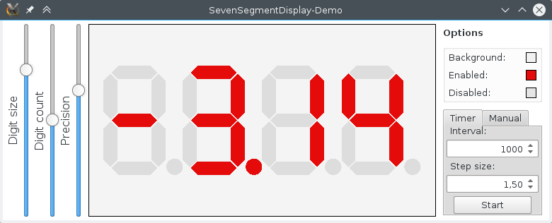

# SevenSegmentDisplay

SevenSegmentDisplay is a Qt Quick widget that imitates a classical seven-segment display.
In contrast to Qt's QLCDNumber, it uses Qt Quicks scene graph for efficient rendering.
The following picture shows the included demo program. As you may see, the widget is highly configurable.



# Building the demo
## General
- Download and unpack the project to an arbitrary place.
- Open a console and change into the root folder of the unpacked project.
- Create a build directory and go into it.
- Create the buildsystem by invoking CMake.
- Build and execute the binary.

## Linux
Assuming that you are in the root folder of the project, the following line should build and execute the demo.
```
$ mkdir build && cd build && cmake .. && make && ./SevenSegmentDisplayDemo
```

## Windows
TODO

# Requirements
- CMake >= 2.8.12
- Qt >= 5.4

# Troubleshooting
If you have problems rendering the GUI (e.g. because your graphics card does not support the features required by Qt Quick 2) try to force software rendering by exporting QT_OPENGL=software.

# TODO
- Add additional alignment options.
- Add literal support.
- Add automatic digit count adaption when fed by string.
- Add QML plugin code.